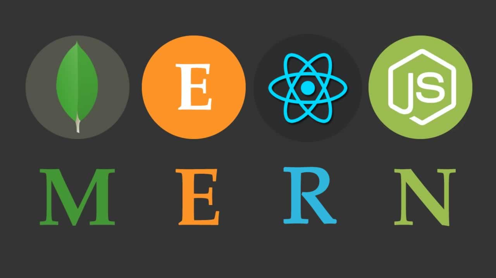
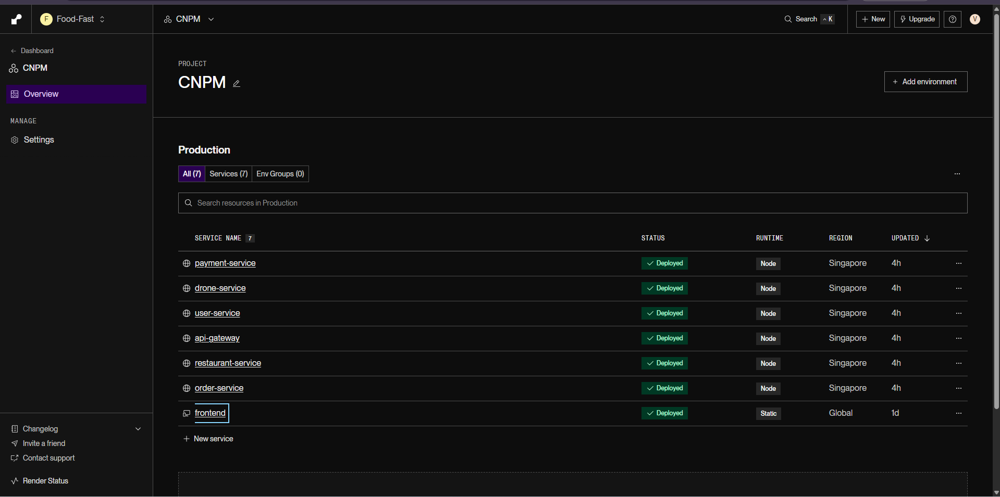
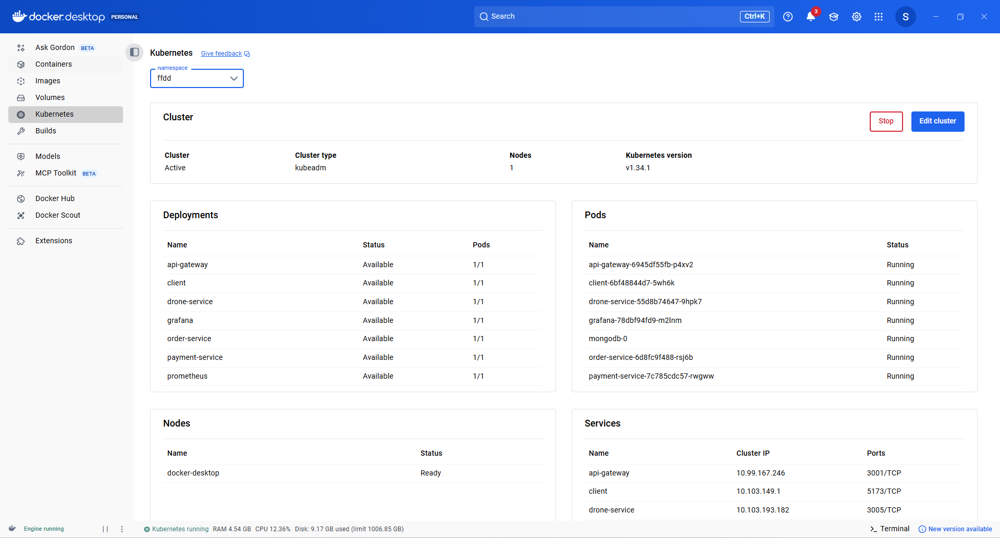
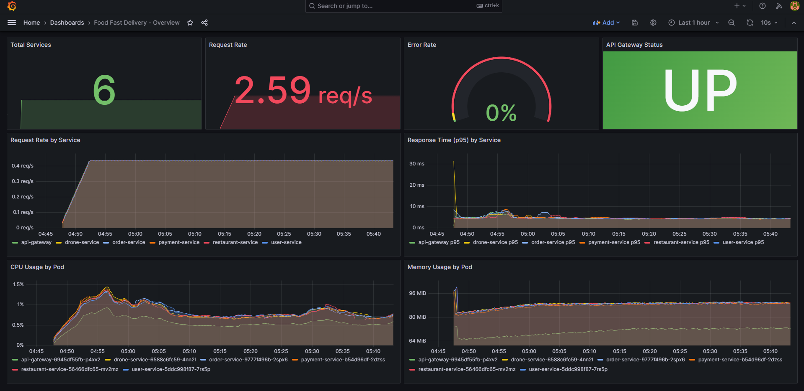
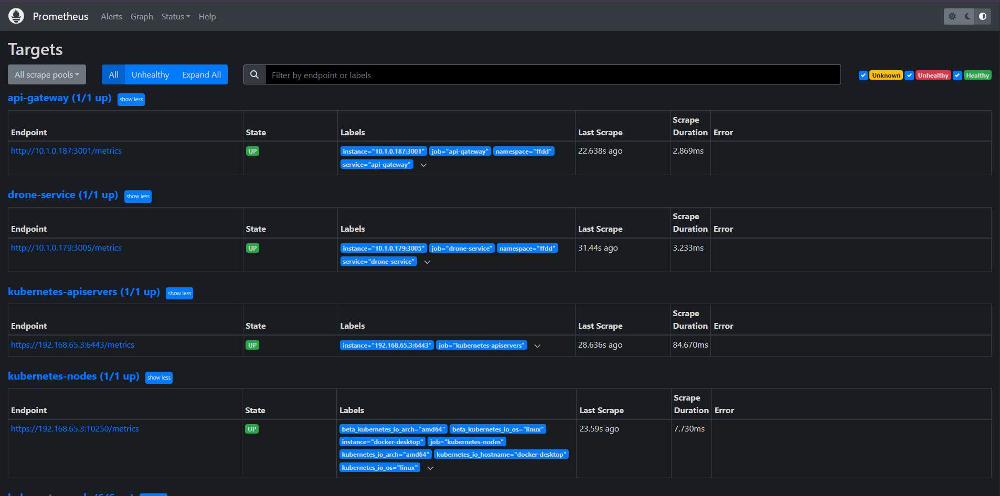

# 🚁 Fast Food Delivery Drone System

> Hệ thống giao đồ ăn nhanh bằng drone với kiến trúc **microservices**, sử dụng **MERN Stack** và **tích hợp thanh toán MoMo**.

<div style="display: flex; justify-content: center; align-items: center; gap: 20px;">
  
  
</div>

---

## 👥 Thành viên thực hiện
- **Võ Duy Toàn** – 3122411218  
- **Lê Thanh Hùng** – 3122411059

---

## 🎯 Giới thiệu

**Fast Food Delivery Drone System** là nền tảng giao đồ ăn hiện đại, tự động hóa việc giao hàng bằng drone.  
Hệ thống được xây dựng theo **kiến trúc microservices**, đảm bảo khả năng mở rộng, bảo trì, và phát triển độc lập từng module.

### 🎯 Mục tiêu
- Tự động hóa quy trình giao hàng bằng drone  
- Theo dõi đơn hàng **real-time** với Socket.IO  
- Tích hợp thanh toán điện tử **MoMo**  
- Cung cấp 3 giao diện: **Customer**, **Restaurant**, **Admin**

---

## 📹 Video Demo

Xem video demo đầy đủ về hệ thống:

[](https://www.youtube.com/watch?v=59t2Jq5CpkM)

Video demo bao gồm:
- 🎬 Giới thiệu tổng quan hệ thống
- 🛒 Quy trình đặt hàng và thanh toán
- 🚁 Theo dõi drone giao hàng real-time
- 🍴 Quản lý nhà hàng và menu
- 👨‍💼 Dashboard quản trị viên

---

## 🌐 Deployment trên Render

Hệ thống được deploy trên **Render** :



## Kubernetes


### 🎯 Kubernetes Features:
-  **Microservices Architecture** - Mỗi service chạy độc lập
-  **Auto-scaling** - Tự động scale theo load
-  **Health Checks** - Liveness và Readiness probes
-  **Service Discovery** - Tự động discovery giữa các services
-  **ConfigMap & Secrets** - Quản lý config và secrets an toàn
-  **Namespace Isolation** - Tách biệt môi trường (ffdd namespace)

### 📦 Services Deployed:
- `api-gateway` - API Gateway service
- `user-service` - User management
- `restaurant-service` - Restaurant & menu
- `order-service` - Order processing
- `drone-service` - Drone tracking
- `payment-service` - Payment processing
- `mongodb` - Database (StatefulSet)
- `client` - Frontend application
---

## 📊 Monitoring với Grafana

Hệ thống tích hợp **Prometheus + Grafana** để giám sát real-time:



### 📈 Metrics được theo dõi:
- **System Metrics:**
  - CPU & Memory usage
  - Request rate & response time
  - Error rate & status codes
  - Network I/O

- **Business Metrics:**
  - Số lượng đơn hàng theo thời gian
  - Doanh thu theo ngày/tuần/tháng
  - Số lượng người dùng active
  - Tỷ lệ thành công của thanh toán

- **Service Health:**
  - Service uptime
  - Database connection pool
  - API response times
  - Drone mission status

### 🎯 Dashboard Features:
-  **Real-time monitoring** - Cập nhật theo thời gian thực
-  **Custom alerts** - Cảnh báo khi có vấn đề
-  **Historical data** - Xem dữ liệu lịch sử
-  **Multi-service view** - Xem tất cả services cùng lúc

### 🔗 Truy cập:
- **Grafana Dashboard:** http://localhost:31000 (admin/admin123)
- **Prometheus:** http://localhost:30090

Xem hướng dẫn chi tiết: [GRAFANA.md](GRAFANA.md) | [MONITORING.md](MONITORING.md)


## ✨ Tính năng chính

### 👤 Khách hàng (Customer)
-  Đăng ký / Đăng nhập tài khoản
-  Duyệt danh sách nhà hàng và món ăn
-  Đặt món ăn và thanh toán MoMo (QR code)
-  Xem lịch sử đơn hàng

### 🍴 Nhà hàng (Restaurant)
-  Quản lý menu (thêm, sửa, xóa món ăn)
-  Quản lý đơn hàng (xác nhận, từ chối, xử lý)
-  Quản lý drone giao hàng
-  Theo dõi nhiệm vụ giao hàng

### 👨‍💼 Quản trị viên (Admin)
-  Quản lý người dùng hệ thống
-  Quản lý nhà hàng (phê duyệt)
-  Quản lý đơn hàng toàn hệ thống
-  Duyệt nhà hàng mới đăng ký

---

## 🏗️ Kiến trúc hệ thống

**Microservices chính:**
- **API Gateway** – Điểm vào duy nhất cho tất cả request
- **User Service** – Quản lý xác thực và tài khoản người dùng
- **Restaurant Service** – Quản lý nhà hàng và menu
- **Order Service** – Quản lý đơn hàng và logic giao hàng
- **Drone Service** – Quản lý drone, tracking vị trí real-time
- **Payment Service** – Xử lý thanh toán MoMo

**Frontend:**
- Customer Interface  
- Restaurant Dashboard  
- Admin Dashboard  

**Database:** MongoDB  
**Realtime Communication:** Socket.IO  

---

## 🛠️ Công nghệ sử dụng

| Loại | Công nghệ |
|------|------------|
| **Frontend** | React, Vite, TailwindCSS, Axios, Zustand |
| **Backend** | Node.js, Express, MongoDB, Mongoose |
| **Realtime** | Socket.IO |
| **Authentication** | JWT, Bcrypt |
| **Payment Gateway** | MoMo API |
| **DevOps** | Docker, Nginx |
| **Build Tools** | Concurrently, npm |
| **Monitoring** | Prometheus, Grafana |

---

## 🚀 Quick Start

**Muốn chạy nhanh?** Xem [QUICK-START.md](QUICK-START.md)
### Tóm tắt nhanh:

1. **Install dependencies:**
   ```powershell
   cd services\user-service; npm install; cd ..\..
   cd services\restaurant-service; npm install; cd ..\..
   cd services\order-service; npm install; cd ..\..
   cd services\drone-service; npm install; cd ..\..
   cd services\payment-service; npm install; cd ..\..
   cd services\api-gateway; npm install; cd ..\..
   ```

2. **Build Docker images:**
   ```powershell
   docker-compose up -d --build
   ```
   

3. **Deploy lên Kubernetes:**
	```powershell
   	cd k8s\
	.\deploy.bat
	cd ..\..
   ```

4. **Deploy Monitoring:**
   ```powershell
	cd k8s\monitoring
	.\deploy-monitoring.bat
	cd ..\..
	```

**Chi tiết đầy đủ:** Xem [QUICK-START.md](QUICK-START.md)

---

## 📊 Monitoring & Observability

Hệ thống tích hợp **Prometheus + Grafana** để giám sát và trực quan hóa metrics real-time:

### 🚀 Quick Deploy

```bash
# Windows
k8s\monitoring\deploy-monitoring.bat

# Linux/Mac
./k8s/monitoring/deploy-monitoring.sh
```

### 🎯 Truy cập

- **Grafana Dashboard:** http://localhost:31000 (admin/admin123)
- **Prometheus:** http://localhost:30090

### ✨ Features

- 📊 System health & performance metrics
- 🔥 Request rate & response time monitoring
- 💻 CPU & Memory usage tracking
- 🚨 Real-time alerting
- 📈 Business metrics (orders, revenue, users)

### 📚 Documentation

- **[Quick Start (5 phút)](k8s/monitoring/QUICK-START.md)** - Bắt đầu nhanh
- **[Full Guide](GRAFANA.md)** - Hướng dẫn chi tiết (~600 dòng)
- **[Setup Services](k8s/monitoring/SETUP-SERVICES.md)** - Thêm metrics cho services
- **[Overview](MONITORING.md)** - Tổng quan monitoring

---

## ⚙️ Cài đặt nhanh

```bash
# Clone dự án
git clone https://github.com/Scarlet7153/food-fast-delivery.git
cd food-fast-delivery

# Cài đặt tất cả dependencies
cd client; npm install
cd ../services/api-gateway ; npm install
cd ../user-service ; npm install
cd ../restaurant-service ; npm install
cd ../order-service ; npm install
cd ../drone-service ; npm install
cd ../payment-service ; npm install
cd ../..
# Chạy toàn bộ services
npm run microservices:start
	
# Chạy client
npm run dev:client
```

---

## 📂 Cấu trúc dự án

```
food-fast-delivery/
├── services/
│   ├── api-gateway/
│   ├── user-service/
│   ├── restaurant-service/
│   ├── order-service/
│   ├── drone-service/
│   └── payment-service/
├── client/
│   ├── customer/
│   ├── restaurant/
│   └── admin/
└── docker-compose.yml
```

---

## 📘 API Documentation

Base URL (API Gateway): `http://localhost:3001/api`

---

### Authentication / User

- POST `/api/user/register` — Đăng ký người dùng
	- Body: { name, email, password, phone, role }
	- Response: 201 { user, token }

- POST `/api/user/login` — Đăng nhập
	- Body: { email, password }
	- Response: 200 { token, user }

- POST `/api/user/logout` — Đăng xuất
	- Protected: Có (Authorization)

- POST `/api/user/logout-all` — Đăng xuất tất cả phiên
	- Protected: Có

- POST `/api/user/refresh` — Làm mới token
	- Body: { refreshToken }

- POST `/api/user/forgot-password` — Quên mật khẩu
	- Body: { email }

- POST `/api/user/reset-password` — Đặt lại mật khẩu
	- Body: { token, password }

- GET `/api/user/me` — Lấy profile user hiện tại
	- Protected: Có

- PUT `/api/user/profile` — Cập nhật profile
	- Protected: Có
	- Body: { name, phone, address, ... }

- PUT `/api/user/change-password` — Đổi mật khẩu
	- Protected: Có
	- Body: { currentPassword, newPassword }

- GET `/api/user/check-email` — Kiểm tra email có sẵn
	- Query: ?email=...

- GET `/api/user/check-phone` — Kiểm tra số điện thoại có sẵn
	- Query: ?phone=...

- GET `/api/user/payment-info` — Lấy thông tin thanh toán của user
	- Protected: Có

- POST `/api/user/payment-info` — Tạo thông tin thanh toán
	- Protected: Có

- PUT `/api/user/payment-info/:id` — Cập nhật thông tin thanh toán
	- Protected: Có

- DELETE `/api/user/payment-info/:id` — Xóa thông tin thanh toán
	- Protected: Có

- PUT `/api/user/payment-info/:id/default` — Đặt làm mặc định
	- Protected: Có

**Admin endpoints:**
- GET `/api/admin/users` — Lấy danh sách users (admin)
	- Protected: role: admin

- GET `/api/admin/users/:id` — Lấy chi tiết user (admin)
	- Protected: role: admin

- PATCH `/api/admin/users/:id/status` — Cập nhật trạng thái user (admin)
	- Protected: role: admin

- GET `/api/admin/dashboard` — Dashboard admin
	- Protected: role: admin

- GET `/api/admin/overview` — Tổng quan hệ thống (admin)
	- Protected: role: admin

- GET `/api/admin/analytics` — Analytics admin
	- Protected: role: admin

- GET `/api/admin/system` — Thống kê hệ thống (admin)
	- Protected: role: admin

---

### Restaurant

**Public routes:**
- GET `/api/restaurants` — Lấy danh sách nhà hàng
	- Query params: q, city, page, limit, isOpen

- GET `/api/restaurants/:id` — Lấy chi tiết nhà hàng (kèm menu)

- GET `/api/restaurants/owner/:ownerId` — Lấy nhà hàng theo owner

- GET `/api/restaurants/:id/delivery-fee` — Tính phí giao hàng
	- Query: ?distance=...

- GET `/api/restaurants/:restaurantId/menu` — Lấy menu của nhà hàng

- GET `/api/restaurants/menu/item/:id` — Lấy chi tiết món ăn

- GET `/api/restaurants/:restaurantId/menu/popular` — Lấy món phổ biến

- GET `/api/restaurants/menu/search` — Tìm kiếm món ăn
	- Query: ?q=...

**Restaurant owner routes (protected):**
- GET `/api/restaurants/me` — Lấy nhà hàng của tôi
	- Protected: role: restaurant

- PUT `/api/restaurants/me` — Cập nhật nhà hàng của tôi
	- Protected: role: restaurant

- POST `/api/restaurants/me/toggle-status` — Bật/tắt nhà hàng
	- Protected: role: restaurant

- GET `/api/restaurants/me/menu` — Lấy menu của nhà hàng tôi
	- Protected: role: restaurant

- POST `/api/restaurants` — Tạo nhà hàng mới
	- Body: { name, address, city, openingHours, ... }

- PUT `/api/restaurants/:id` — Cập nhật nhà hàng
	- Protected: role: restaurant (owner) hoặc admin

- POST `/api/restaurants/:restaurantId/menu` — Thêm món vào menu
	- Protected: role: restaurant
	- Body: { name, price, description, image, category, stock }

- PUT `/api/restaurants/menu/:id` — Cập nhật món ăn
	- Protected: role: restaurant

- DELETE `/api/restaurants/menu/:id` — Xóa món ăn
	- Protected: role: restaurant

- PATCH `/api/restaurants/menu/:id/stock` — Cập nhật tồn kho
	- Protected: role: restaurant
	- Body: { stock }

**Rating routes:**
- POST `/api/restaurants/:id/rating` — Đánh giá nhà hàng
	- Protected: Có
	- Body: { rating, comment }

- POST `/api/restaurants/menu/:id/rating` — Đánh giá món ăn
	- Protected: Có
	- Body: { rating, comment }

**Admin routes:**
- GET `/api/admin/restaurants` — Lấy tất cả nhà hàng (admin)
	- Protected: role: admin

- GET `/api/admin/restaurants/pending` — Lấy danh sách nhà hàng chờ duyệt
	- Protected: role: admin

- GET `/api/admin/restaurants/:id` — Lấy chi tiết nhà hàng (admin)
	- Protected: role: admin

- PATCH `/api/admin/restaurants/:id/approve` — Duyệt nhà hàng
	- Protected: role: admin
	- Body: { approved: true/false }

- PATCH `/api/admin/restaurants/:id/reject` — Từ chối nhà hàng
	- Protected: role: admin

- PATCH `/api/admin/restaurants/:id/status` — Cập nhật trạng thái nhà hàng (admin)
	- Protected: role: admin

- GET `/api/admin/statistics` — Thống kê nhà hàng (admin)
	- Protected: role: admin

- GET `/api/admin/overview` — Tổng quan nhà hàng (admin)
	- Protected: role: admin

---

### Order

**Customer routes:**
- POST `/api/orders` — Tạo đơn hàng
	- Protected: Có
	- Body: { restaurantId, items: [{ itemId, quantity }], deliveryAddress, paymentMethod }

- GET `/api/orders/user` — Lấy đơn hàng của user
	- Protected: Có

- GET `/api/orders/:id` — Lấy chi tiết đơn hàng
	- Protected: Có

- PATCH `/api/orders/:id/status` — Cập nhật trạng thái đơn
	- Protected: Có (chỉ một số status nhất định)

- PATCH `/api/orders/:id/cancel` — Hủy đơn hàng
	- Protected: Có

- POST `/api/orders/:id/rate` — Đánh giá đơn hàng
	- Protected: Có
	- Body: { rating, comment }

- PATCH `/api/orders/:id/confirm-delivery` — Xác nhận đã nhận hàng
	- Protected: Có

**Restaurant routes:**
- GET `/api/orders/restaurant/orders` — Lấy đơn hàng của nhà hàng
	- Protected: role: restaurant

- GET `/api/orders/restaurant/stats` — Thống kê đơn hàng nhà hàng
	- Protected: role: restaurant

- POST `/api/orders/:orderId/assign-drone` — Gán drone cho đơn hàng
	- Protected: role: restaurant
	- Body: { droneId }

**Admin routes:**
- GET `/api/admin/orders` — Lấy tất cả đơn hàng
	- Protected: role: admin

- GET `/api/admin/orders/:id` — Lấy chi tiết đơn hàng (admin)
	- Protected: role: admin

- PATCH `/api/admin/orders/:id/status` — Cập nhật trạng thái đơn (admin)
	- Protected: role: admin

- POST `/api/admin/orders/:orderId/assign-drone` — Gán drone cho đơn (admin)
	- Protected: role: admin

- GET `/api/admin/orders/statistics` — Thống kê đơn hàng (admin)
	- Protected: role: admin

- GET `/api/admin/orders/overview` — Tổng quan đơn hàng (admin)
	- Protected: role: admin

---
### Payment

- POST `/api/payments/momo/create` — Tạo yêu cầu thanh toán MoMo
	- Protected: Có (Authorization)
	- Body: { orderId }
	- Response: 200 { paymentUrl, qrCode, ... }

- POST `/api/payments/momo/verify` — Xác thực thanh toán MoMo
	- Protected: Có
	- Body: { orderId, ... }

- POST `/api/payments/momo/notify` — Callback từ MoMo (không cần auth)
	- Body: { ... } (từ MoMo gateway)

- POST `/api/payments/momo/ipn` — IPN từ MoMo (không cần auth)
	- Body: { ... } (từ MoMo gateway)

- GET `/api/payments/user` — Lấy danh sách thanh toán của user
	- Protected: Có

- GET `/api/payments/:id` — Lấy chi tiết thanh toán
	- Protected: Có

- GET `/api/payments/:id/status` — Kiểm tra trạng thái thanh toán
	- Protected: Có

- POST `/api/payments/refund` — Tạo yêu cầu hoàn tiền
	- Protected: Có
	- Body: { paymentId, reason, ... }

- GET `/api/payments/restaurant/payments` — Lấy danh sách thanh toán của nhà hàng
	- Protected: role: restaurant

- GET `/api/payments/restaurant/statistics` — Thống kê thanh toán nhà hàng
	- Protected: role: restaurant

---

### Drone & Mission

**Restaurant routes (protected):**
- GET `/api/restaurant/drones` — Lấy danh sách drone của nhà hàng
	- Protected: role: restaurant

- GET `/api/restaurant/drones/available` — Lấy drone có sẵn
	- Protected: role: restaurant

- GET `/api/restaurant/drones/statistics` — Thống kê drone
	- Protected: role: restaurant

- GET `/api/restaurant/drones/:id` — Lấy chi tiết drone
	- Protected: role: restaurant

- POST `/api/restaurant/drones` — Tạo drone mới
	- Protected: role: restaurant
	- Body: { name, model, status, ... }

- PUT `/api/restaurant/drones/:id` — Cập nhật thông tin drone
	- Protected: role: restaurant

- DELETE `/api/restaurant/drones/:id` — Xóa drone
	- Protected: role: restaurant

- PATCH `/api/restaurant/drones/:id/status` — Cập nhật trạng thái drone
	- Protected: role: restaurant
	- Body: { status }

- PATCH `/api/restaurant/drones/:id/location` — Cập nhật vị trí drone
	- Protected: role: restaurant
	- Body: { latitude, longitude }

**Mission routes (protected):**
- GET `/api/restaurant/missions` — Lấy danh sách nhiệm vụ
	- Protected: role: restaurant

- GET `/api/restaurant/missions/statistics` — Thống kê nhiệm vụ
	- Protected: role: restaurant

- GET `/api/restaurant/missions/:id` — Lấy chi tiết nhiệm vụ
	- Protected: role: restaurant

- POST `/api/restaurant/missions` — Tạo nhiệm vụ mới
	- Protected: role: restaurant
	- Body: { orderId, droneId, ... }

- PATCH `/api/restaurant/missions/:id/status` — Cập nhật trạng thái nhiệm vụ
	- Protected: role: restaurant
	- Body: { status }

- POST `/api/restaurant/missions/:id/path` — Thêm điểm đường đi
	- Protected: role: restaurant
	- Body: { latitude, longitude, ... }

**Simulation routes (protected):**
- POST `/api/restaurant/missions/:id/simulate` — Bắt đầu mô phỏng chuyến bay
	- Protected: role: restaurant
	- Body: { missionId }

- POST `/api/restaurant/missions/:id/stop-simulation` — Dừng mô phỏng
	- Protected: role: restaurant

- GET `/api/restaurant/simulations/active` — Lấy danh sách mô phỏng đang chạy
	- Protected: role: restaurant

**Admin routes:**
- GET `/api/admin/drones` — Lấy tất cả drone (admin)
	- Protected: role: admin

- GET `/api/admin/drones/:id` — Lấy chi tiết drone (admin)
	- Protected: role: admin

- PATCH `/api/admin/drones/:id/status` — Cập nhật trạng thái drone (admin)
	- Protected: role: admin

- GET `/api/admin/missions` — Lấy tất cả nhiệm vụ (admin)
	- Protected: role: admin

- GET `/api/admin/missions/:id` — Lấy chi tiết nhiệm vụ (admin)
	- Protected: role: admin

- POST `/api/admin/missions` — Tạo nhiệm vụ (admin)
	- Protected: role: admin

- PATCH `/api/admin/missions/:id/status` — Cập nhật trạng thái nhiệm vụ (admin)
	- Protected: role: admin

- GET `/api/admin/statistics` — Thống kê drone & mission (admin)
	- Protected: role: admin

- GET `/api/admin/overview` — Tổng quan drone & mission (admin)
	- Protected: role: admin
---

📌 Common response examples

- Success: 200 OK { data }
- Created: 201 Created { data }
- 400 Bad Request { message, errors }
- 401 Unauthorized { message }
- 403 Forbidden { message }
- 404 Not Found { message }

---

## 📚 Tài liệu tham khảo

### Getting Started
- **[QUICK-START.md](QUICK-START.md)** - Hướng dẫn setup từ đầu đến cuối (11-19 phút)

### Docker & Development
- **[DOCKER.md](DOCKER.md)** - Hướng dẫn Docker chi tiết
- **[docker-compose.yml](docker-compose.yml)** - Docker Compose configuration

### Kubernetes & Deployment
- **[KUBERNETES.md](KUBERNETES.md)** - Hướng dẫn Kubernetes chi tiết
- **[k8s/README.md](k8s/README.md)** - Kubernetes deployment guide

### Monitoring & Observability
- **[MONITORING.md](MONITORING.md)** - Tổng quan monitoring
- **[GRAFANA.md](GRAFANA.md)** - Hướng dẫn Grafana chi tiết
- **[k8s/monitoring/README.md](k8s/monitoring/README.md)** - Monitoring setup guide
- **[k8s/monitoring/QUICK-START.md](k8s/monitoring/QUICK-START.md)** - Quick start monitoring

---

## 📄 License
- Dự án được phát triển cho mục đích học tập.

