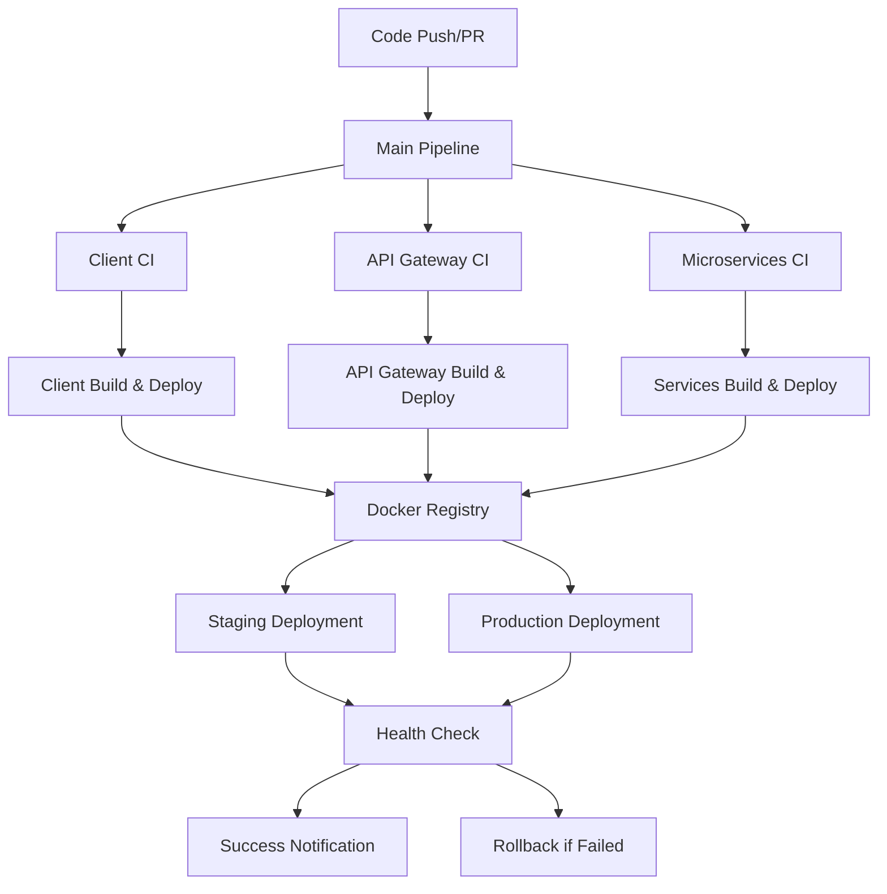

# 🚀 CI/CD Pipeline cho Food Fast Delivery

## 📋 Tổng quan

Dự án Food Fast Delivery đã được triển khai CI/CD pipeline hoàn chỉnh sử dụng GitHub Actions. Pipeline này đảm bảo:

- ✅ **Automated Testing**: Tự động test tất cả services
- ✅ **Code Quality**: ESLint, security scanning
- ✅ **Docker Build**: Tự động build và push Docker images
- ✅ **Deployment**: Tự động deploy staging và production
- ✅ **Security**: Vulnerability scanning, dependency review
- ✅ **Monitoring**: Health checks và rollback tự động

## 🏗️ Kiến trúc Pipeline



## 📁 Cấu trúc Files

```
.github/
├── workflows/
│   ├── main.yml                 # Main pipeline
│   ├── client.yml               # Client CI/CD
│   ├── api-gateway.yml          # API Gateway CI/CD
│   ├── user-service.yml         # User Service CI/CD
│   ├── restaurant-service.yml   # Restaurant Service CI/CD
│   ├── order-service.yml        # Order Service CI/CD
│   ├── drone-service.yml        # Drone Service CI/CD
│   ├── payment-service.yml      # Payment Service CI/CD
│   ├── docker-build.yml         # Docker build & security scan
│   ├── deploy.yml               # Deployment workflow
│   └── security.yml             # Security scanning
├── ISSUE_TEMPLATE/
│   ├── bug_report.md
│   └── feature_request.md
├── dependabot.yml               # Dependency updates
├── pull_request_template.md     # PR template
└── CICD_GUIDE.md               # Detailed guide
```

## 🚦 Workflow Triggers

### Main Pipeline
- **Trigger**: Push/PR vào `main` hoặc `develop`
- **Chức năng**: Test tất cả services, build Docker images

### Service-specific Pipelines
- **Trigger**: Khi có thay đổi trong service folder tương ứng
- **Chức năng**: Test, build, deploy service cụ thể

### Security Pipeline
- **Trigger**: Push/PR + Schedule (hàng tuần)
- **Chức năng**: Security scanning, vulnerability check

## 🔧 Cấu hình cần thiết

### 1. GitHub Secrets
```bash
# Container Registry (tự động)
GITHUB_TOKEN

# Database
MONGO_URI
MONGO_USERNAME
MONGO_PASSWORD

# Payment (Momo)
MOMO_PARTNER_CODE
MOMO_ACCESS_KEY
MOMO_SECRET_KEY

# Cloudinary
CLOUDINARY_CLOUD_NAME
CLOUDINARY_API_KEY
CLOUDINARY_API_SECRET

# Deployment (nếu sử dụng cloud)
AWS_ACCESS_KEY_ID
AWS_SECRET_ACCESS_KEY
KUBECONFIG
```

### 2. GitHub Environments
- **staging**: Environment cho testing
- **production**: Environment cho production

### 3. Branch Protection Rules
- Require PR reviews
- Require status checks
- Require up-to-date branches
- Restrict pushes to main/develop

## 🎯 Cách sử dụng

### Development Workflow
```bash
# 1. Tạo feature branch
git checkout -b feature/new-feature

# 2. Push code
git push origin feature/new-feature

# 3. Tạo Pull Request
# → Workflow sẽ chạy test cho services có thay đổi
```

### Staging Deployment
```bash
# Merge vào develop branch
git checkout develop
git merge feature/new-feature
git push origin develop

# → Tự động deploy to staging
```

### Production Deployment
```bash
# Merge vào main branch
git checkout main
git merge develop
git push origin main

# → Tự động deploy to production
```

### Manual Deployment
1. Vào GitHub Actions tab
2. Chọn workflow "Deploy to Environments"
3. Click "Run workflow"
4. Chọn environment
5. Click "Run workflow"

## 📊 Monitoring

### 1. GitHub Actions Dashboard
- Xem trạng thái tất cả workflows
- Xem logs chi tiết
- Monitor performance

### 2. Security Tab
- CodeQL alerts
- Dependency vulnerabilities
- Secret scanning results

### 3. Dependabot
- Tự động update dependencies
- Security updates
- Weekly schedule

## 🛡️ Security Features

### 1. Code Quality
- ESLint cho client
- Security audit cho tất cả services
- CodeQL analysis

### 2. Dependency Security
- NPM audit
- Dependabot updates
- Dependency review

### 3. Container Security
- Trivy vulnerability scanning
- Docker image security
- Multi-stage builds

### 4. Secret Management
- GitHub Secrets
- Environment variables
- Secret scanning

## 🔄 Rollback Strategy

### Automatic Rollback
- Health check failure → Auto rollback
- Deployment timeout → Auto rollback
- Critical error → Auto rollback

### Manual Rollback
1. Vào GitHub Actions
2. Chọn commit cũ
3. Re-run deployment workflow

## 📈 Performance Optimization

### 1. Parallel Execution
- Services test song song
- Docker builds song song
- Optimized job dependencies

### 2. Caching
- Node.js dependencies cache
- Docker layer cache
- Build artifacts cache

### 3. Conditional Execution
- Chỉ build khi cần thiết
- Path-based triggers
- Smart dependency management

## 🐛 Troubleshooting

### Common Issues

#### 1. Test Failures
```bash
# Kiểm tra logs
# Kiểm tra test environment
# Kiểm tra dependencies
```

#### 2. Build Failures
```bash
# Kiểm tra Dockerfile
# Kiểm tra dependencies
# Kiểm tra resource limits
```

#### 3. Deployment Failures
```bash
# Kiểm tra environment variables
# Kiểm tra network connectivity
# Kiểm tra service health
```

### Debug Steps
1. Check GitHub Actions logs
2. Verify environment variables
3. Test locally
4. Check service dependencies
5. Review recent changes

## 📚 Tài liệu tham khảo

- [GitHub Actions Documentation](https://docs.github.com/en/actions)
- [Docker Best Practices](https://docs.docker.com/develop/dev-best-practices/)
- [Node.js Security](https://nodejs.org/en/docs/guides/security/)
- [CI/CD Best Practices](https://docs.github.com/en/actions/learn-github-actions)

## 🤝 Contributing

1. Fork repository
2. Tạo feature branch
3. Commit changes
4. Push to branch
5. Tạo Pull Request
6. Review và merge

## 📞 Support

Nếu có vấn đề với CI/CD pipeline:
1. Kiểm tra logs trong GitHub Actions
2. Tạo issue với thông tin chi tiết
3. Liên hệ team DevOps

---

**🎉 Chúc mừng! Bạn đã có một CI/CD pipeline hoàn chỉnh cho dự án Food Fast Delivery!**
