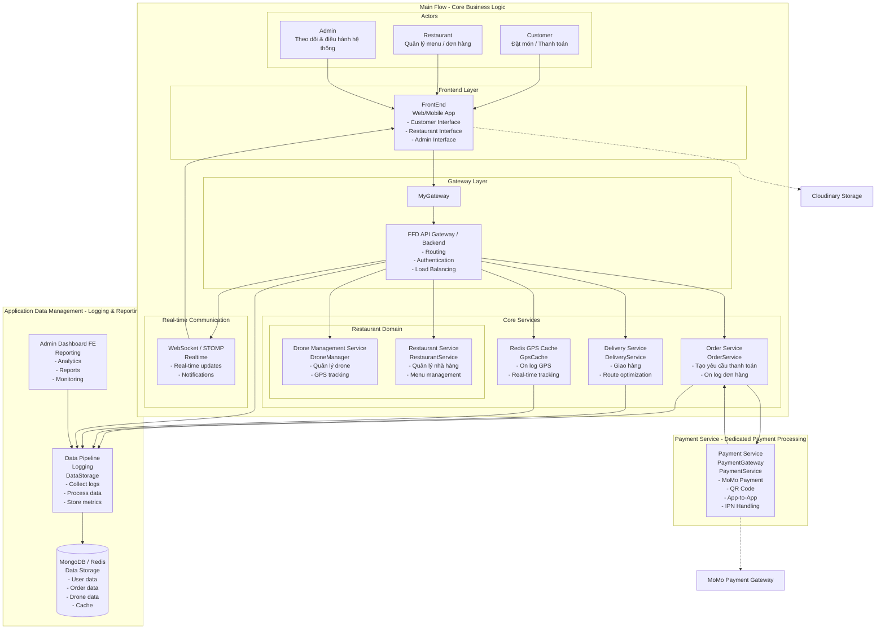
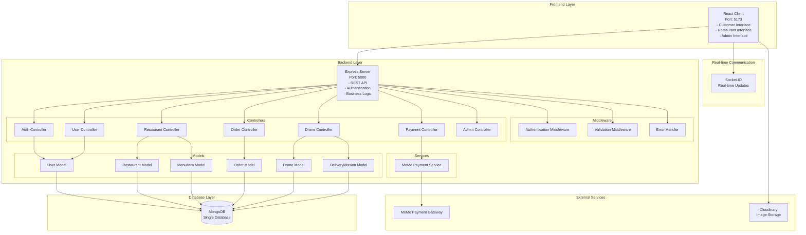
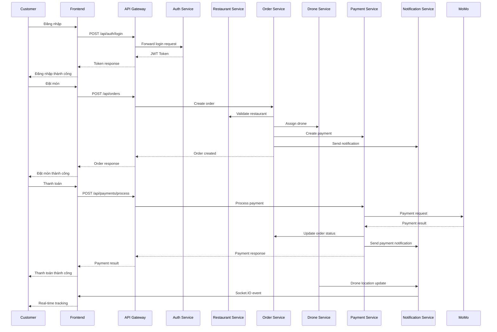
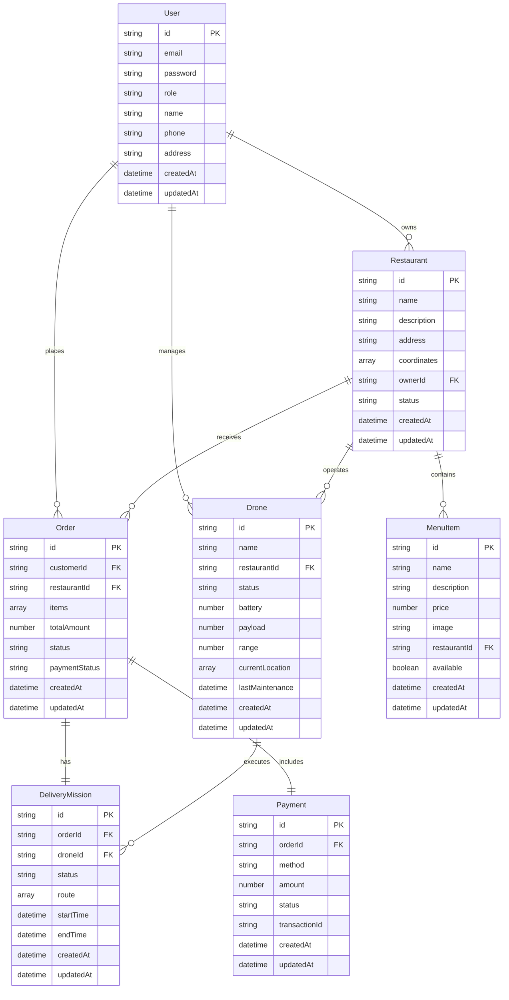

# Sơ đồ Component - Food Fast Delivery System

## 1. Kiến trúc Component theo Style UML (Như ảnh gửi)

## 2. Chi tiết các Component và Interface

### Main Flow (Core Business Logic)
- **Customer**: Actor tương tác để "Đặt món / Thanh toán"
- **Restaurant**: Actor tương tác để "Quản lý menu / đơn hàng"  
- **Admin**: Actor tương tác để "Theo dõi & điều hành hệ thống"
- **FrontEnd**: Giao diện web/mobile cho tất cả 3 loại người dùng
- **MyGateway**: Interface kết nối FrontEnd với API Gateway
- **FFD API Gateway / Backend**: Điểm vào trung tâm cho tất cả services
- **Order Service**: Xử lý đơn hàng, tạo yêu cầu thanh toán, cập nhật trạng thái
- **Restaurant Domain**: 
  - **Drone Management Service**: Quản lý drone với interface "DroneManager"
  - **Restaurant Service**: Quản lý nhà hàng với interface "RestaurantService"
- **Delivery Service**: Xử lý giao hàng với interface "DeliveryService"
- **Redis GPS Cache**: Cache GPS với interface "GpsCache", có kết nối "On log GPS"
- **WebSocket / STOMP**: Giao tiếp real-time với interface "Realtime"

### Payment Service (Dedicated Payment Processing)
- **Payment Service**: Xử lý thanh toán với 2 interfaces:
  - **PaymentGateway**: Nhận yêu cầu từ API Gateway
  - **PaymentService**: Nhận yêu cầu từ Order Service ("Tạo yêu cầu thanh toán") và gửi cập nhật ("Cập nhật trạng thái đơn hàng")

### Application Data Management (Logging & Reporting)
- **Admin Dashboard FE**: Giao diện admin với interface "Reporting"
- **Data Pipeline**: Xử lý dữ liệu với 2 interfaces:
  - **Logging**: Nhận logs từ API Gateway, Order Service, Delivery Service, Redis GPS Cache
  - **DataStorage**: Lưu trữ dữ liệu vào MongoDB/Redis
- **MongoDB / Redis**: Lưu trữ dữ liệu chính

## 3. Kiến trúc Monolith (Backup/Legacy)

## 3. Component Interaction Flow

## 4. Database Schema Overview

## 5. Technology Stack

### Frontend
- **React 18** + **Vite** - UI Framework
- **TailwindCSS** - Styling
- **Zustand** - State Management
- **Socket.IO Client** - Real-time Communication
- **Axios** - HTTP Client

### Backend (Microservices)
- **Node.js** + **Express** - API Framework
- **MongoDB** + **Mongoose** - Database
- **JWT** - Authentication
- **Socket.IO** - Real-time Communication
- **Winston** - Logging

### Backend (Monolith)
- **Node.js** + **Express** - API Framework
- **MongoDB** + **Mongoose** - Database
- **JWT** - Authentication
- **Socket.IO** - Real-time Communication
- **MoMo Payment Gateway** - Payment Processing

### External Services
- **MoMo E-Wallet** - Payment Gateway
- **Cloudinary** - Image Storage
- **MongoDB Atlas** - Database Hosting
